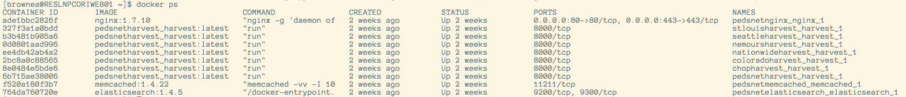
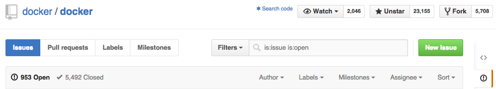
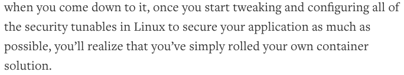
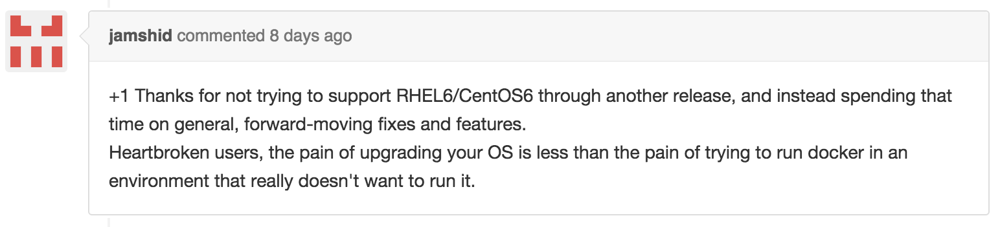

# DBHi Containerization Retreat

What's working, what isn't, and what might.

## What the &#%$ is a container?

Efficient, isolated application environment and runtime.

- Separates an application from the infrastructure it runs on...
- by intelligently saving an isolated filesystem image for the app...
- and providing an isolated and secure virtual computing environment...
- in the form of a lightweight container.
- [Understanding Docker](https://docs.docker.com/introduction/understanding-docker/)
- Core technologies: namespaces, control groups, union file systems, container format
- [Container performance is nearly equivalent to bare-metal](http://www.enterprisetech.com/2014/08/18/ibm-techies-pit-docker-kvm-bare-metal/)


## Why should I give a $%#&?

The right abstraction at the right time: application as independent unit.

- Developers forced to define configuration and deployment "APIs"...
- which lays the groundwork for drastic improvement in...
    - Faster delivery
    - Consistent deployment
    - Ability to scale
    - Efficient use of resources
    - Change management
- As well as enabling flexible workflow options such as...
    - Multiple deployments (for testing, etc)
    - Portability (to the cloud or end users' infrastructure)
    - Infrastructure upgrade


## Has this ever worked in the real world?

When it works, it is a thing of beauty!

- Biorepository Toolkit demo at AMIA
    - Interactive live demo spun up for workshop at AMIA
    - Application includes:
        - Nautilus
        - RedCap
        - eHonest Broker
        - ETL
        - Harvest
        - Biorepository Portal
    - Huge positive response
- PEDSnet site-specific Harvest instances
    - Changing requirements led to the need for multiple deployments
    - Two "flavors" of the app were needed
    - Each instance connected to different DB, available at different endpoint
    - Expanded from one to seven instances within a week



## When hasn't it worked, and why?

When it doesn't work, it's a big problem.

- Docker makes use of bleeding edge kernel features and has lots of code turnover.
    - Open-source agile development style is not a seamless (ha!) fit with enterprise computing.
    - Three minor versions released this calendar year, all with major features.
    - Most recent available officially for RHEL 6 is through EPEL and released in February, two minor versions behind.
- Networking and firewall integration has been difficult.
    - Docker modifies iptables/firewalld configuration to support inter-container networking.
        - This conflicts with automated firewall compliance scripts.
        - Fixed in 1.5.0 by creating separate DOCKER iptables chain.
    - Name server change possibly not propogated from host to container.
    - Inter-container linking does not always survive container restart.
- Permissions on volumes mounted between containers and hosts can be tricky.
- Configuration and deployment "APIs" vary between developers.
- Log aggregation and conventions are in their infancy.



## How's it going with security?

How can we make Docker, and containerization more generally, an above-board use-case?

- Containerization should mean **more** security.
- Totally compatibly with existing security measures.
    - SELinux, AppArmor, GRSEC, PAX, etc.
- It places many new security configs in the hands of devs, so we need some standards.
    - Separated network stacks with control over communication.
    - Control groups to limit resource usage.
    - Linux kernel capabilities to control system access at fine-grain.
- However, the docker deamon runs as root.
    - Just like other virtualization, host filesystems are mounted into containers without limited rights.
    - Access to docker deamon is essentially access to `sudo su`.
    - **User namespacing is coming soon!**
- Standardized docker host setup would help.
    - [Docker Machine](https://docs.docker.com/machine/)
    - [RHEL 7 Atomic Host](http://www.redhat.com/en/about/blog/small-footprint-big-impact-red-hat-enterprise-linux-7-atomic-host-beta-now-available)
- Developer guidelines for secure container usage would help, as well.
- [Security in Docker](https://docs.docker.com/articles/security/)
- [Containers are security](https://medium.com/@ewindisch/on-the-security-of-containers-2c60ffe25a9e)



## How's it going with operations?

RHEL 6 and Docker have some serious issues.

- Recent RHEL kernel upgrade and recent versions of docker cause kernel panics when combined.
- Downgrade to Docker 1.3.3 avoids kernel panics.
    - But, it's missing some key functionality (networking, etc).
    - Where did this version as the last working one come from?
- Docker 1.7.1 is due out this week (on rc3) and it's promised to restore interoperability.
    - But, testing isn't going so hot.
    - [PR](https://github.com/docker/docker/pull/14264)
- Kernel upgrade on June 19 to kernel-2.6.32-504.23.4.el6.x86_64.
    - Could go back to kernel-2.6.32-504.12.2.el6.x86_64
    - [Downgrade working for this guy](https://github.com/docker/docker/pull/14264#issuecomment-119400753).
    - But not for others.
    - Any serious risk in that downgrade?
- Can we try Docker 1.6.x with the older kernel?
- Docker dropping support for RHEL 6 in 1.8.0 (Aug 9) anyway...
    - [Milestone](https://github.com/docker/docker/milestones/1.8.0)
    - [Issue](https://github.com/docker/docker/issues/14365)
    - [Breakdown and advice](https://github.com/docker/docker/issues/14365#issuecomment-118177542)
    - [Heartbroken users](https://github.com/docker/docker/issues/14365#issuecomment-118227138)
- Could do some selective RHEL 7 upgrades.
    - What would this break?



## How can we make Docker hosts easier than traditional hosts?

Containerization should make special-snowflake hosts obselete.

- Host requirements should boil down to:
    - Linux kernel > 3.10
    - Docker binary
    - Some SOP for config
- In fact, devs shouldn't ever have to ssh into the host again, just access the docker daemon.
- Could implement a standard for docker host deployment at CHOP (including RHEL 7).
- Could adopt an existing docker host implementation/management system:
    - RHEL 7 Atomic Host
        - [Beta available](http://www.redhat.com/en/about/blog/small-footprint-big-impact-red-hat-enterprise-linux-7-atomic-host-beta-now-available)
        - [Datasheet](http://www.redhat.com/en/resources/red-hat-enterprise-linux-atomic-host)
        - [Project Atomic](http://www.projectatomic.io/)
    - [CoreOS](https://coreos.com/)
    - [Docker Machine](https://docs.docker.com/machine/)
- RHEL Atomic Host and CoreOS use rpm-ostree to make atomic OS upgrades.


## How do people actually use Docker?

#### Get a Docker Engine running locally:

[Install Docker Machine](https://docs.docker.com/machine/#installation)
[Install VirtualBox 4.3.28](https://www.virtualbox.org/wiki/Download_Old_Builds_4_3)

```
docker-machine create --driver virtualbox dev
eval "$(docker-machine env dev)"
docker images
docker ps
```

#### Get an image:

```
docker pull ubuntu:14.04
docker images
```

#### Work in ubuntu:

```
docker run -i -t ubuntu:14.04 /bin/bash
cat /etc/debian_version
exit
docker ps -a
```

#### Echo "hello world" forever in the background (from Ubuntu!):

```
docker run -d --name hello-world ubuntu:14.04 /bin/sh -c "while true; do echo hello world; sleep 1; done"
docker ps -a
docker logs hello-world
docker stop hello-world
```

#### Build and run a node.js "hello world" server:

```
git clone https://github.com/aaron0browne/docker-node-hello.git
cd docker-node-hello
cat Dockerfile
docker build -t chop-dbhi/docker-node-hello .
docker images
docker run -d --name node-hello docker-p 8080:8080 chop-dbhi/docker-node-hello
docker ps -a
open "http://$(docker-machine ip dev):8080"
docker stop node-hello
```

#### Delete containers:

```
docker rm node-hello hello-world
docker ps -a
```

#### Delete images:

```
docker rmi chop-dbhi/docker-node-hello
docker images
```

## How do real people with real-world problems actually use Docker?

- Configuration options
    - Build with config file (requires rebuild to change config).
    - Pass environment variables on run ([Docker Compose](https://docs.docker.com/compose/yml/) can help).
        - `docker run -e FOO=bar --rm ubuntu:14.04 /bin/sh -c "echo \$FOO"`
        - `echo FOO=bar > env.txt`
        - `docker run --env-file env.txt --rm ubuntu:14.04 /bin/sh -c "echo \$FOO"`
        - Requires restart to change config.
    - Retrieve config from external service (etcd, for example).
        - Nice to gracefully fall back on environment variables.
    - For more complicated config (postgresql, nginx, etc):
        - Mount config file from host.
        - Generate config file:
            - [Tiller](https://github.com/markround/tiller)
            - [confd](https://github.com/kelseyhightower/confd)
- [Data persistence](https://docs.docker.com/userguide/dockervolumes/)
    - Mount instance-specific data from host.
    - Write produced data into host mount.
    - Data containers (may be expecially useful in an Atomic Host plus mounted SAN type configuration).
- Networking
    - Expose ports on host (deterministic or ephemeral with write to config service).
    - [Container linking](https://docs.docker.com/userguide/dockerlinks/)
        - Adds `/etc/hosts` and envrionment variables.
        - Subtleties with `--icc=false`
    - [Ambassodor pattern](https://docs.docker.com/articles/ambassador_pattern_linking/)
- Multi-container applications
    - [Docker Compose](https://docs.docker.com/compose/)
    - [Kubernetes](http://kubernetes.io/)

## What's coming down the pipe?

- [What's in 1.7?](https://docs.docker.com/release-notes/)
    - [Multi-host networking](http://blog.docker.com/2015/06/networking-receives-an-upgrade/)
    - [Plugin architecture](http://blog.docker.com/2015/06/extending-docker-with-plugins/)
    - [Docker Swarm](http://blog.docker.com/2015/06/compose-1-3-swarm-0-3-machine-0-3/)
- What else is coming in 1.8?
    - [Split out runtime](https://github.com/docker/docker/issues/14212)
        - [Open Container Project](https://github.com/docker/docker/issues/14212)
        - [Inspiring spec](https://github.com/opencontainers/specs)
        - [CoreOS/rkt seems to have a different spec](https://github.com/appc/spec/)
    - [Top-level Volume Management](https://github.com/docker/docker/issues/14214)
    - [Low-level image storage improvements](https://github.com/docker/docker/pull/14067)
    - [Container checkpoint/restore?](https://github.com/docker/docker/pull/13602)
    - [Logging improvement?](https://github.com/docker/docker/pull/11485)
    - [User namespaces?](https://github.com/docker/docker/pull/12648)

## What could internal app deployment could look like?

- Data Model DDL Generator deployment
    - Full CI/CD workflow using docker images throughout the pipeline
    - Requires four DBMS client libraries plus a visualization library
    - Totally automated using GitHub, CircleCI, Docker Hub, and AWS
    - Demo
